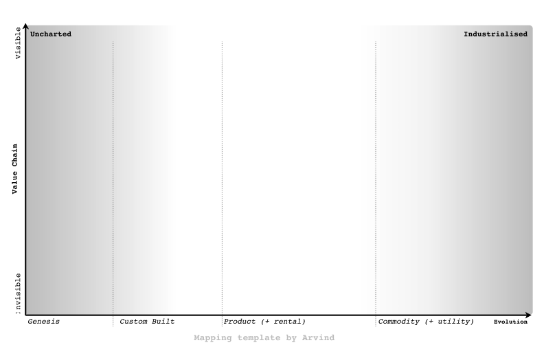
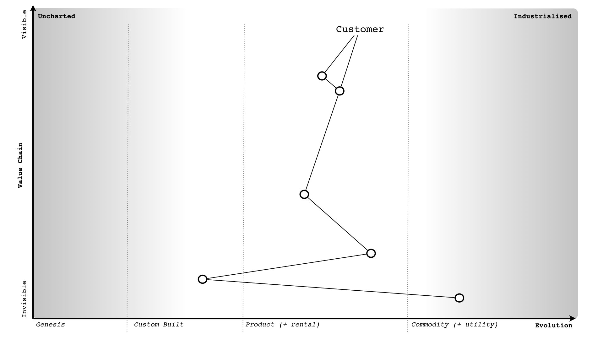
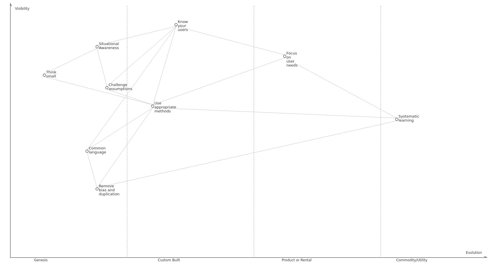
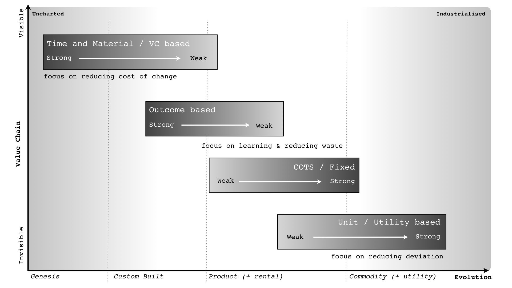
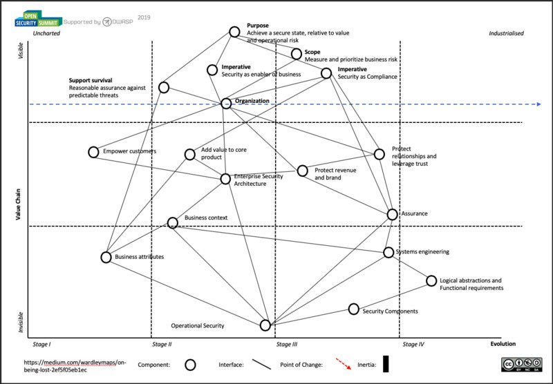
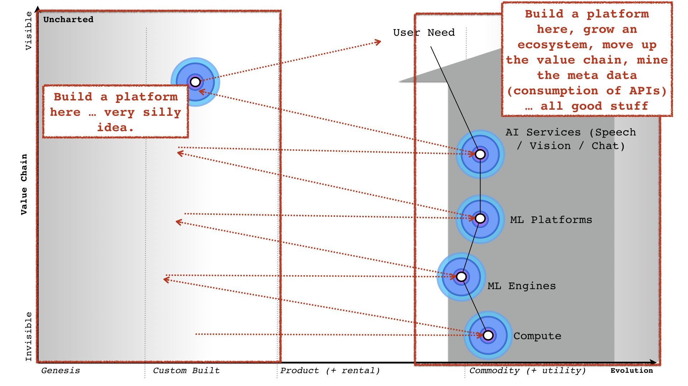
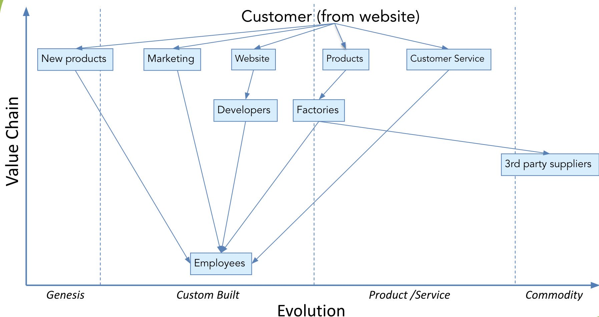
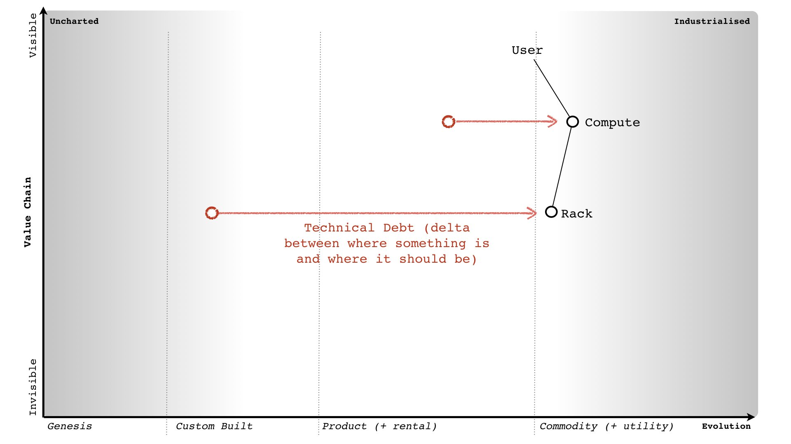
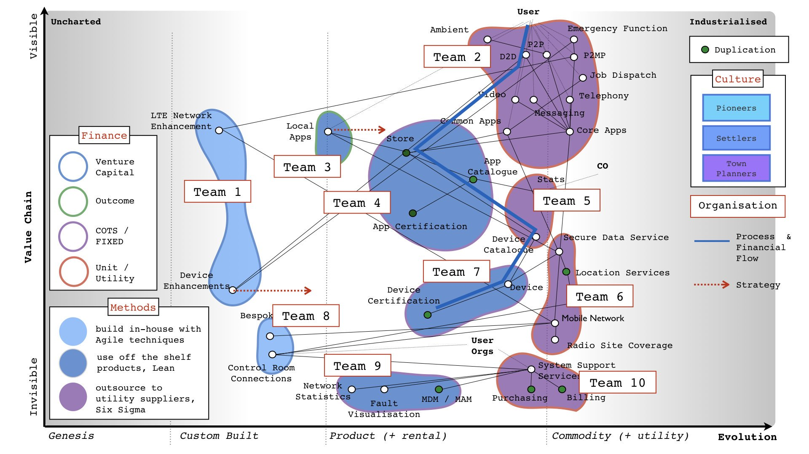

# Maps

### Wardley Mapping Template by Arvind
<a href="https://www.figma.com/file/Oa9DvuPdSpqiqw2a6qyRj9/Arvind-s-Wardley-Mapping-Template?node-id=0%3A1">

#### Hiring
<a href="https://threadreaderapp.com/thread/1171783735785807874.html">

#### InfoSec
<a href="https://twitter.com/madplatt/status/1164272601373597697">

#### Measuring Performance
<a href="https://threadreaderapp.com/thread/1158345324005601283.html">

#### Open Security
<a href="https://twitter.com/madplatt/status/1165528044083261440">

#### Organisational Culture
<a href="https://threadreaderapp.com/thread/1164499389337034753.html">

#### Security Focused
<a href="https://twitter.com/DinisCruz/status/1161969060290207745">

#### Technical Debt
<a href="https://twitter.com/swardley/status/1164837968755875843">

#### Team Sizing
<a href="https://threadreaderapp.com/thread/1158762383784984578.html">

